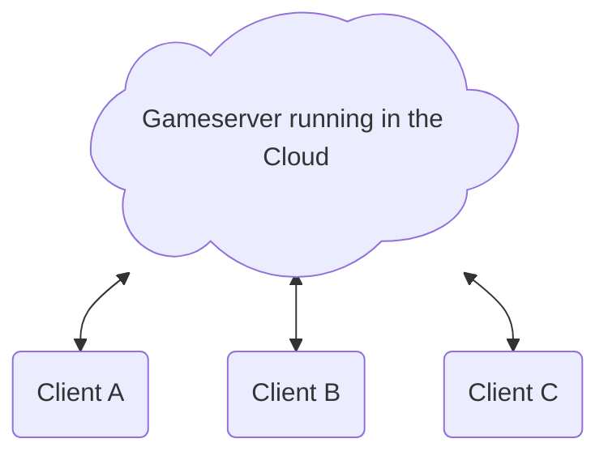

# Network Topology

:::warning[Be careful when using WebRTC for a typical Client-Server approach!]

If you are using a typical Client (Cloud)-Server connection WebRTC is probably not the right tool for you. It is probably possible to use it but a simple UDPServer is likely better for you. The strength of WebRTC is to connection two clients that are behind a NAT, that don't have a static public IP Address or that you don't know the public IP Address off. In a typical Client (Cloud)-Server connection you have a public accessible Server and know their IP Address.

:::