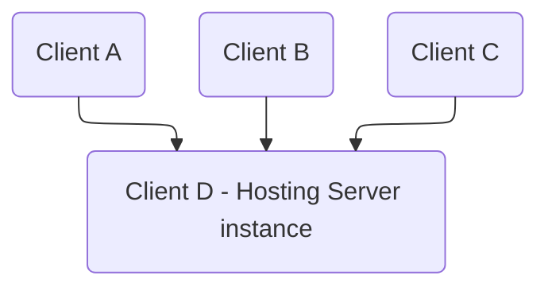
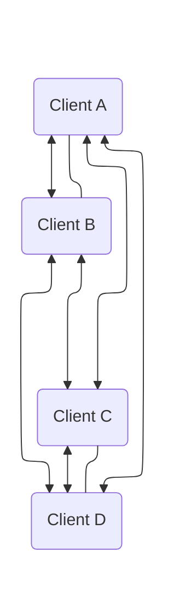
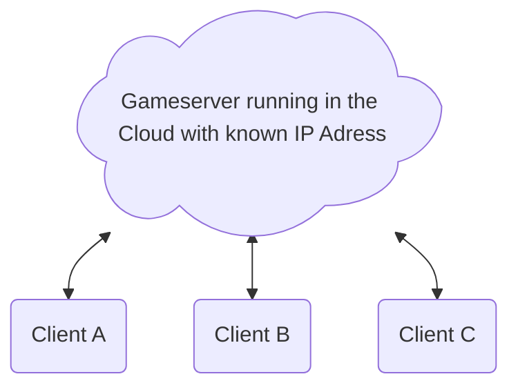

# Is WebRTC for you?

One big thing you have to keep in mind when you are asking yourself if WebRTC is for you is Network Topology.

## Network Topology

WebRTC is supperior if you **don't** know the IP Adress of the Server you are connecting to. This is the case if you don't host game server instances on your own infrastructure but letting one of the players host the server instance on thir own PC. Especially if they dont have a static IP, are behind a firewall / NAT or in a local network where device-device communication is perhibbited. This is also possible with multiple peers. They can either be all connected to one peer or all be interconnected among themselves. 

:::danger[Be careful when using WebRTC for a typical Client-Server approach!]

If you are using a typical Client (Cloud)-Server connection WebRTC is probably not the right tool for you. It is probably possible to use it but a simple UDPServer is likely better for you. The strength of WebRTC is to connection two clients that are behind a NAT, that don't have a static public IP Address or that you don't know the public IP Address off. In a typical Client (Cloud)-Server connection you have a public accessible Server and know their IP Address.

:::