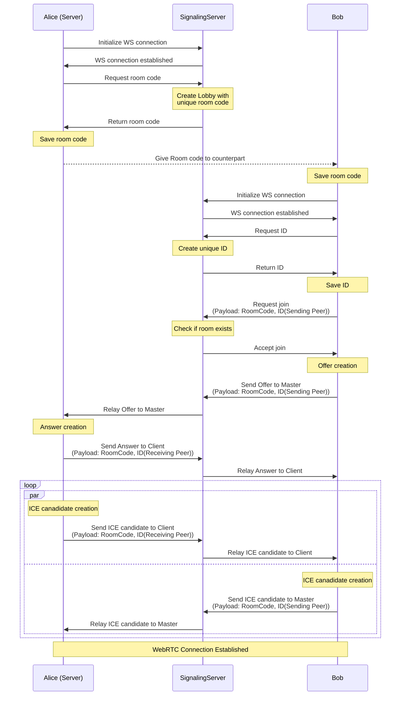

# ... a Signaling Server?

A signaling server isn't something defined in the WebRTC standard. It's sole purpose is to get the ICE Candidate Data from one peer to another. You could also dictate the data to your counterpart and type it into a text field. But that would be very inefficient. We need something to create groups of Peers, maybe a "Master", and a way to relay messages between them. In other words a way to create and manage Lobbys and relay Messages between their participants.


## My Signaling Server

The Peers and the Signaling Server need to know the structure of the protocoll beforehand. Both must be implemented simuntaniously. I created multiple Message Types for the entire Relay Flow. 

```ts
export enum MessageType{
    Id,
    RoomCode,
    Join,
    Offer,
    Answer,
    Candidate,
    UserConnected,
    UserDisconnected,
    CheckIn
};
```

Every message can be salted with one or multiple of these payloads.

```ts
export interface MessagePayload {
    type: MessageType;
    from?: number;
    to?: number;
    room_code?: string;
    id?: number;
    webrtc_type?: string;
    sdp?: string;
    media?: string;
    index?: number;
    name?: string;
    successful?: boolean;
}
```

| Column 1      | Column 2      |
| ------------- | ------------- |
| Cell 1, Row 1 | Cell 2, Row 1 |
| Cell 1, Row 2 | Cell 1, Row 2 |

### Diagram
